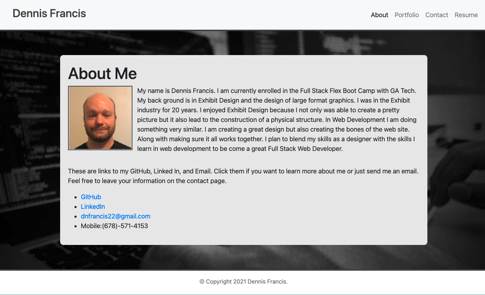
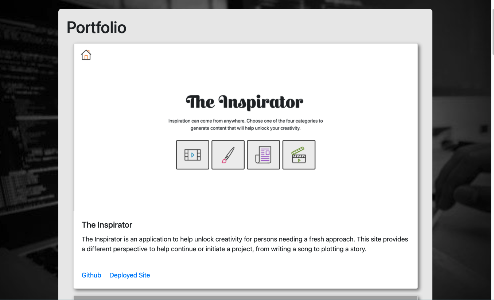

# responsive-portfolio

**Description**

This is a site that I created to display information about my self. There are four pages. Home, About Me, and Portfolio page. The About Me page is where I have a short biography about my self. I also share links to my LinkedIn site, GitHub and my email address. The Portfolio page currently displays six of the top projects that I have completed. As I complete more projects I will add them here. On any of the pages if you click on the resume link in the navbar you will be taken to Google Docs to view my resume.

**Installation**

click here: https://dnfrancis22.github.io/Revised-Portfolio/

**Usage**

Located in the nav bar are links. About, Portfolio, and Resume. If you click on the links they will take you to their specific pages. If you click on the Resume link you will be taken to Google Docs to view my resume. If you click on the About link it will take you to the About page.

On the About page you can click on any of the links provided. They will take you to either my LinkedIn site, GitHub or allow you to send me an email. If you click on the Portfolio link it will take you to the Portfolio page.

On the Portfolio page you can scroll through examples of my work. Each example has a screenshot of the site as well as a title and a brief description. There are also links to either Github or the deployed site. On any of the pages, if you click on my name in the top left corner it will take you back to the Home page.

**License**

MIT License

Copyright (c) [2020] [Dennis Francis]

Permission is hereby granted, free of charge, to any person obtaining a copy
of this software and associated documentation files (the "Software"), to deal
in the Software without restriction, including without limitation the rights
to use, copy, modify, merge, publish, distribute, sublicense, and/or sell
copies of the Software, and to permit persons to whom the Software is
furnished to do so, subject to the following conditions:

The above copyright notice and this permission notice shall be included in all
copies or substantial portions of the Software.

THE SOFTWARE IS PROVIDED "AS IS", WITHOUT WARRANTY OF ANY KIND, EXPRESS OR
IMPLIED, INCLUDING BUT NOT LIMITED TO THE WARRANTIES OF MERCHANTABILITY,
FITNESS FOR A PARTICULAR PURPOSE AND NONINFRINGEMENT. IN NO EVENT SHALL THE
AUTHORS OR COPYRIGHT HOLDERS BE LIABLE FOR ANY CLAIM, DAMAGES OR OTHER
LIABILITY, WHETHER IN AN ACTION OF CONTRACT, TORT OR OTHERWISE, ARISING FROM,
OUT OF OR IN CONNECTION WITH THE SOFTWARE OR THE USE OR OTHER DEALINGS IN THE
SOFTWARE.

